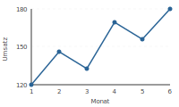
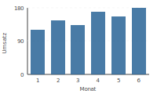
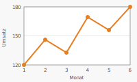
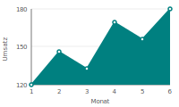

# Präsentationen mit externen Datendateien (LaTeX Beamer + pgfplots)

Dieses Dokument beschreibt, wie man in LaTeX-Präsentationen (z. B. mit dem `beamer`-Paket) Plots direkt aus externen CSV- oder TXT-Dateien erzeugt. Der Ansatz trennt Daten sauber von der Präsentation: Messwerte liegen in einer Textdatei, `pgfplots` liest sie ein und rendert den Plot direkt auf der gewünschten Folie.

## Workflow: Externe Datei → Plot → Folie

```
messwerte.csv  →  \addplot table  →  tikzpicture/pgfplots  →  frame (Beamer)
     ↑                  ↑                     ↑                       ↑
 Datenquelle      Lese-Befehl           Diagramm-Code           Folie der PDF
```

Vorteile dieses Workflows:
- **Datentrennung:** Zahlen in CSV/TXT, Layout in LaTeX.
- **Reproduzierbarkeit:** Neue Werte → CSV aktualisieren → PDF neu kompilieren.
- **Qualität:** Vektorgrafik (PDF), perfekte Typographie, kein Rasterisierungsartefakt.

---

## Dateiformat: CSV und TXT

`pgfplots` liest tabellarische Textdateien mit Leerzeichen, Tabs oder Komma als Trennzeichen. Die erste Zeile kann Spaltennamen enthalten.

### Beispiel-Datendatei (`messwerte.csv`)

```
monat,umsatz
1,120
2,145
3,132
4,168
5,155
6,178
```

Alternativ als Leerzeichen-getrennte TXT-Datei (`messwerte.txt`):

```
monat umsatz
1     120
2     145
3     132
4     168
5     155
6     178
```

> **Hinweis:** Sonderzeichen oder Umlaute in Spaltennamen vermeiden – `pgfplots` verarbeitet einfache ASCII-Bezeichner am zuverlässigsten.

---

## LaTeX-Präambel

```latex
\documentclass{beamer}

\usepackage{pgfplots}
\pgfplotsset{compat=1.18}   % aktuelle Kompatibilitätsstufe

% Optional: einheitliches Farbschema für alle Plots
\pgfplotsset{
  every axis/.style={
    grid=major,
    grid style={dashed, gray!30},
    tick style={thin, black},
  }
}

\begin{document}
```

---

## Plots mit `pgfplots` aus externen Daten erstellen

### Linienplot aus CSV



```latex
\begin{frame}{Umsatzentwicklung}
  \begin{tikzpicture}
    \begin{axis}[
      xlabel={Monat},
      ylabel={Umsatz},
      xmin=0.5, xmax=6.5,
      xtick={1,...,6},
      width=0.85\textwidth,
      height=0.65\textheight,
    ]
      \addplot[
        color=blue!70!black,
        mark=*,
        thick,
      ] table[
        col sep=comma,   % Trennzeichen: Komma (CSV)
        x=monat,         % Spaltenname für x-Achse
        y=umsatz,        % Spaltenname für y-Achse
      ] {messwerte.csv};
    \end{axis}
  \end{tikzpicture}
\end{frame}
```

**Schlüsseloptionen:**

| Option | Bedeutung |
|--------|-----------|
| `col sep=comma` | Komma als Trennzeichen; für TXT: `col sep=space` |
| `x=monat` | Spaltenname der x-Werte (aus der Kopfzeile) |
| `y=umsatz` | Spaltenname der y-Werte |
| `mark=*` | Gefüllter Punkt an jedem Datenpunkt |
| `thick` | Dickere Linie für Präsentations-Lesbarkeit |

---

### Balkendiagramm aus CSV



```latex
\begin{frame}{Monatlicher Umsatz (Balken)}
  \begin{tikzpicture}
    \begin{axis}[
      ybar,                      % vertikale Balken
      xlabel={Monat},
      ylabel={Umsatz},
      xtick=data,                % Ticks nur an Datenpunkten
      bar width=14pt,
      width=0.85\textwidth,
      height=0.65\textheight,
      nodes near coords,         % Wert über jedem Balken anzeigen
      every node near coord/.style={font=\small},
    ]
      \addplot[
        fill=blue!60,
        draw=blue!80!black,
      ] table[
        col sep=comma,
        x=monat,
        y=umsatz,
      ] {messwerte.csv};
    \end{axis}
  \end{tikzpicture}
\end{frame}
```

> **Tipp:** `nodes near coords` zeigt den y-Wert automatisch über jedem Balken an – nützlich für Präsentationen ohne Legende.

---

### Mehrspaltige Datei: zwei Kurven auf einem Plot

Enthält die CSV-Datei mehrere Messspalten, lassen sich mehrere `\addplot`-Befehle mit derselben Datei kombinieren:

```
% prognose.csv
monat,ist,soll
1,120,130
2,145,140
3,132,145
4,168,150
5,155,155
6,178,160
```

```latex
\begin{axis}[
  legend pos=north west,
  xlabel={Monat}, ylabel={Umsatz},
  width=0.85\textwidth, height=0.65\textheight,
]
  \addplot[color=blue!70!black, mark=*, thick]
    table[col sep=comma, x=monat, y=ist]   {prognose.csv};
  \addplot[color=red!70!black, mark=square*, thick, dashed]
    table[col sep=comma, x=monat, y=soll]  {prognose.csv};
  \legend{Ist-Wert, Sollwert}
\end{axis}
```

---

## Beamer: Plots auf spezifischen Folien

### Einfache Folie mit Plot

Ein Plot lässt sich wie jeder andere Beamer-Inhalt auf genau einer Folie platzieren:

```latex
\begin{frame}{Nur diese Folie zeigt den Plot}
  \begin{center}
    \begin{tikzpicture}
      \begin{axis}[width=9cm, height=6cm]
        \addplot table[col sep=comma, x=monat, y=umsatz] {messwerte.csv};
      \end{axis}
    \end{tikzpicture}
  \end{center}
\end{frame}
```

### Plot neben Text auf derselben Folie

```latex
\begin{frame}{Analyse: Q1–Q2}
  \begin{columns}
    \begin{column}{0.55\textwidth}
      \begin{tikzpicture}
        \begin{axis}[width=\columnwidth, height=5cm,
                     xlabel={Monat}, ylabel={Umsatz}]
          \addplot[mark=*, blue!70!black, thick]
            table[col sep=comma, x=monat, y=umsatz] {messwerte.csv};
        \end{axis}
      \end{tikzpicture}
    \end{column}
    \begin{column}{0.42\textwidth}
      \begin{itemize}
        \item Starker Anstieg in Monat 4
        \item Trend insgesamt positiv
        \item Prognose: Ziel in Monat 7 erreichbar
      \end{itemize}
    \end{column}
  \end{columns}
\end{frame}
```

### Schrittweise Daten-Enthüllung mit Overlays

Beamer-Overlays blenden Elemente folienseitig ein. Mit `\addplot` und `\onslide` lässt sich der Plot Datenpunkt für Datenpunkt oder kurvenweise aufbauen:

```latex
\begin{frame}{Umsatz – schrittweise Enthüllung}
  \begin{tikzpicture}
    \begin{axis}[width=0.85\textwidth, height=0.65\textheight,
                 xlabel={Monat}, ylabel={Umsatz},
                 xmin=0.5, xmax=6.5]

      % Folie 1: nur Monate 1–3
      \onslide<1->{
        \addplot[color=blue!70!black, mark=*, thick]
          coordinates {(1,120) (2,145) (3,132)};
      }

      % Folie 2: vollständige Kurve
      \onslide<2->{
        \addplot[color=blue!70!black, mark=*, thick, dashed]
          coordinates {(3,132) (4,168) (5,155) (6,178)};
      }

    \end{axis}
  \end{tikzpicture}
\end{frame}
```

> **Hinweis:** Für komplexe Animationen mit direkt aus CSV eingelesenen Teildaten empfiehlt sich `\pgfplotstableread` (einmaliges Einlesen) kombiniert mit `\pgfplotstablegetelem` zum gezielten Zugriff auf Zeilen.

### Daten einmalig einlesen, mehrfach verwenden

```latex
% In der Präambel oder vor dem ersten frame:
\pgfplotstableread[col sep=comma]{messwerte.csv}\datatable

% Dann in verschiedenen frames wiederverwenden:
\begin{frame}{Übersicht}
  \begin{tikzpicture}
    \begin{axis}[width=9cm, height=6cm]
      \addplot table[x=monat, y=umsatz] {\datatable};
    \end{axis}
  \end{tikzpicture}
\end{frame}

\begin{frame}{Nur Monate 1–3}
  \begin{tikzpicture}
    \begin{axis}[xmin=0.5, xmax=3.5, width=9cm, height=6cm]
      \addplot table[x=monat, y=umsatz] {\datatable};
    \end{axis}
  \end{tikzpicture}
\end{frame}
```

---

## Tool-Vergleich

Alle Werkzeuge in dieser Tabelle verwenden dieselbe CSV-Datei (`messwerte.csv` mit den Spalten `monat` und `umsatz`).

| Tool | Code-Beispiel | Visuelles Ergebnis | Interaktiv | Stärken |
|------|---------------|--------------------|------------|---------|
| **LaTeX** (`beamer` + `pgfplots`) | `\addplot table[col sep=comma, x=monat, y=umsatz] {messwerte.csv};` |  | Nein – statisches PDF | Vektorgrafik, perfekte Typographie, kein externes Tool nötig |
| **Python** (`matplotlib` + `pandas`) | `df = pd.read_csv(...); ax.plot(df.monat, df.umsatz)` |  | Mit `plotly`: Ja | Flexible Skripte, PPTX-Export, Notebooks |
| **Typst** (`cetz-plot`-Package) | `plot.plot(data: csv("messwerte.csv"), ...)` |  | Nein – statisch | Modernes Markup, schnelle Kompilierung, CSV-Unterstützung nativ |

### Ausführlichere Code-Beispiele zum Vergleich

**LaTeX / Beamer + pgfplots** – vollständige Folie:

```latex
\documentclass{beamer}
\usepackage{pgfplots}
\pgfplotsset{compat=1.18}

\begin{document}
\begin{frame}{Umsatzentwicklung}
  \begin{tikzpicture}
    \begin{axis}[
      xlabel={Monat}, ylabel={Umsatz},
      width=0.85\textwidth, height=0.65\textheight,
    ]
      \addplot[color=blue!70!black, mark=*, thick]
        table[col sep=comma, x=monat, y=umsatz]{messwerte.csv};
    \end{axis}
  \end{tikzpicture}
\end{frame}
\end{document}
```

**Python** – Plot als PNG erzeugen und in PowerPoint einfügen:

```python
import pandas as pd
import matplotlib.pyplot as plt
from pptx import Presentation
from pptx.util import Inches

# Daten laden
df = pd.read_csv("messwerte.csv")

# Plot erstellen und speichern
fig, ax = plt.subplots(figsize=(6, 4))
ax.plot(df["monat"], df["umsatz"], marker="o", color="#e67e22", linewidth=2)
ax.set_xlabel("Monat")
ax.set_ylabel("Umsatz")
ax.grid(True, linestyle="--", alpha=0.5)
fig.savefig("umsatz.png", dpi=150, bbox_inches="tight")
plt.close()

# In PowerPoint-Folie einfügen
prs = Presentation()
slide = prs.slides.add_slide(prs.slide_layouts[5])  # leere Folie
slide.shapes.add_picture("umsatz.png", Inches(1), Inches(1),
                         width=Inches(8), height=Inches(5))
prs.save("praesentation.pptx")
```

**Typst** – mit dem `cetz-plot`-Package (ab cetz 0.3):

```typst
#import "@preview/cetz:0.3.1": canvas
#import "@preview/cetz-plot:0.1.0": plot

#let data = csv("messwerte.csv", row-type: dictionary)

#canvas({
  plot.plot(
    size: (8, 5),
    x-label: "Monat",
    y-label: "Umsatz",
    {
      plot.add(
        data.map(r => (float(r.monat), float(r.umsatz))),
        mark: "o",
        style: (stroke: teal + 1.5pt),
      )
    }
  )
})
```

---

## Tipps & Häufige Fehler

- **Pfad zur Datei:** `pgfplots` sucht die CSV relativ zum Hauptdokument (`.tex`-Datei). Unterordner mit Schrägstrich angeben: `{daten/messwerte.csv}`.
- **Kompilierung:** Bei `\pgfplotsset{compat=...}` immer eine feste Version angeben, um Regressions bei LaTeX-Updates zu vermeiden.
- **Große Dateien:** Ab ca. 10 000 Datenpunkten spürbar langsame Kompilierung. Abhilfe: `\pgfplotsset{max points num=50000}` oder Daten vorher reduzieren.
- **Sonderzeichen in CSV:** Komma im Dezimaltrenner (z. B. `1,5` statt `1.5`) führt zu Fehlern. Immer Punkt als Dezimaltrenner verwenden.
- **Overlays und Achsenskalierung:** Bei `\onslide`-gesteuerten Kurven kann die Achse zwischen den Folien springen. Mit `xmin`, `xmax`, `ymin`, `ymax` fixieren.
- **Schriftgrößen:** Standardmäßig verwendet `pgfplots` kleine Achsenschriften. Für Präsentationen: `tick label style={font=\small}` oder `font=\large` im `axis`-Block setzen.
- **Linienbreite für Beamer:** Standardlinien sind oft zu dünn. Immer `thick` oder `very thick` für Plots in Präsentationen verwenden.
