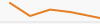

# Sparklines mit LaTeX (`sparklines`)

Sparklines sind sehr kleine, in Fließtext integrierte Datenvisualisierungen (Micro-Charts), populär gemacht durch Edward Tufte. Sie zeigen Trends auf engem Raum, ohne den Lesefluss durch große Diagramme zu unterbrechen.

## Wichtigste Element-Typen

Die folgende Tabelle gibt einen Überblick aller sechs Element-Typen. Die SVG-Vorschauen approximieren, wie die entsprechende LaTeX-Sparkline im gerenderten PDF aussieht.

| # | Typ | Befehl | Visuelles Ergebnis | Anwendungsfall |
|---|-----|--------|--------------------|----------------|
| 1 | Liniengraph | `\spark` |  | Zeitreihen, Trends, kontinuierliche Verläufe |
| 2 | Balkendiagramm | `\sparkspike` |  | Diskrete Werte pro Intervall, Spitzenwerte |
| 3 | Markierungspunkte | `\sparkdot` |  | Min/Max, Ausreißer, Schwellwertverletzungen |
| 4 | Hintergrundband | `\sparkrectangle` |  | Normal- oder Zielbereiche, Toleranzgrenzen |
| 5 | Kombination | `\sparkspike` + `\spark` + `\sparkdot` |  | Mehrfachaussagen: Volumen + Trend + Ereignis |
| 6 | Grundlinie | `\sparkbottomline` |  | Wachstum/Verlust ab Nulllinie, Delta-Werte |

---

### 1) `\spark` – Liniengraph


```latex
\begin{sparkline}{10}
  \spark 0.1 0.95 0.3 0.3 0.5 0.62 0.7 0.5 1.0 0.2 /
\end{sparkline}
```

Die Koordinatenpaare bestehen jeweils aus x- und y-Position im Bereich 0–1 (explizite x-y-Paare, z. B. `0.1 0.95` = Punkt bei x=10 %, y=95 %). Der abschließende `/` beendet die Punktliste.

**Anwendungsfall:** Gut für Zeitreihen mit Fokus auf Trend und Verlauf. Beispiel: Aktienkurs, Temperaturkurve oder tägliche Umsätze.

---

### 2) `\sparkspike` – Balkendiagramm


```latex
\begin{sparkline}{5}
  \sparkspike .083 .18
  \sparkspike .25  .55
  \sparkspike .417 1.0
  \sparkspike .583 .62
  \sparkspike .75  .42
\end{sparkline}
```

Jede `\sparkspike`-Anweisung erzeugt einen einzelnen vertikalen Balken. Das erste Argument gibt die x-Position, das zweite die relative Höhe (0–1) an.

**Anwendungsfall:** Sinnvoll für diskrete Werte pro Intervall, z. B. Monatsbesuche oder Fehler pro Build. Spitzen sind sofort erkennbar.

---

### 3) `\sparkdot` – Markierungspunkte


```latex
\begin{sparkline}{10}
  \spark 0.1 0.95 0.3 0.3 0.5 0.62 0.7 0.5 1.0 0.2 /
  \sparkdot 0.25 0.62 blue
  \sparkdot 1.0  0.2  red
\end{sparkline}
```

`\sparkdot` setzt einen farbigen Punkt auf der Sparkline. Argumente: x-Position, y-Position, Farbe. Punkte werden über die bestehende Linie gelegt.

**Anwendungsfall:** Markiert gezielt Min/Max, Ausreißer oder Schwellwertverletzungen. Hilfreich bei KPI-Reviews mit erklärungsbedürftigen Punkten.

---

### 4) `\sparkrectangle` – Hintergrundband


```latex
\begin{sparkline}{10}
  \sparkrectangle 0.35 0.65
  \spark 0.1 0.95 0.3 0.3 0.5 0.62 0.7 0.5 1.0 0.2 /
\end{sparkline}
```

`\sparkrectangle` zeichnet ein grau gefülltes Band über die gesamte Breite. Die beiden Argumente definieren die untere und obere y-Grenze des Bands.

**Anwendungsfall:** Zeigt Normal- oder Zielbereiche im Hintergrund. Nützlich, um sofort zu sehen, wann Messwerte außerhalb eines tolerierten Bereichs liegen.

---

### 5) Kombination: Linie + Balken + Punkte


```latex
\begin{sparkline}{10}
  \sparkspike .2 .35
  \sparkspike .4 .75
  \sparkspike .6 .45
  \spark 0.1 0.25 0.3 0.55 0.5 0.35 0.7 0.8 0.9 0.4 /
  \sparkdot 0.7 0.8 red
\end{sparkline}
```

Die Reihenfolge der Befehle bestimmt das Rendering: Balken zuerst, dann Linie, dann Punkte (letztere erscheinen immer im Vordergrund).

**Anwendungsfall:** Für kompakte Mehrfachaussagen in einem Mini-Chart: Volumen (Balken), Trend (Linie), Ereignisse (Punkte). Geeignet für Umsatz + Ausreißer in einem Satz.

---

### 6) `\sparkbottomline` – Grundlinie


```latex
\setlength\sparkbottomlinethickness{.2pt}
\begin{sparkline}{10}
  \sparkbottomline 0
  \spark 0.1 0.2 0.3 0.4 0.5 0.35 0.7 0.55 0.9 0.8 /
\end{sparkline}
```

`\sparkbottomline` zeichnet eine horizontale Linie bei der angegebenen y-Position (hier 0 = Basis). Die Dicke wird über `\sparkbottomlinethickness` gesteuert.

**Anwendungsfall:** Eine klare Nulllinie verbessert die Einordnung von Wachstum/Verlust. Besonders hilfreich bei Differenzwerten um 0 oder bei Performance-Delta.

---

## Visueller Tool-Vergleich

Alle Werkzeuge in dieser Tabelle verwenden dieselben fünf x-y-Koordinatenpaare:

```
(x, y):  (0.1, 0.95)  (0.3, 0.30)  (0.5, 0.62)  (0.7, 0.50)  (1.0, 0.20)
```

Die SVG-Vorschauen approximieren das visuelle Ergebnis des jeweiligen Tools. Unterschiede in Farbe und Stil spiegeln typische Defaults der jeweiligen Umgebung wider.

| Tool | Code-Beispiel | Visuelles Ergebnis | Interaktiv | Stärken |
|------|---------------|--------------------|------------|---------|
| **LaTeX** (`sparklines`) | `\spark 0.1 0.95 0.3 0.3 ...` |  | Nein – statisches PDF | Perfekte Typographie, Inline-Integration in Fließtext, PDF/Print-Qualität |
| **Python** (`matplotlib`) | `ax.plot([0.1,0.3,...], [0.95,0.3,...])` |  | Mit `plotly`: Ja | Flexible Skripte, Dashboards, Notebooks (Jupyter) |
| **Typst** (`cetz`-Package) | `canvas({ draw.line((0,0.95),(0.3,0.3),...) })` |  | Nein – statisch | Modernes, code-basiertes Markup als LaTeX-Alternative |
| **Markdown** (Unicode) | ` ▁█▃▅▄▄▂ ` | `▁█▃▅▄▄▂` | Nein | Ultrakompakt, kein Build-Schritt, überall lesbar |
| **R** (`sparkline`-Paket) | `sparkline(c(0.95,0.3,0.62,0.5,0.2))` | `▁█▃▅▂` *(HTML-Widget)* | Ja – HTML | Statistik-Workflows, Shiny, R Markdown |
| **Vega-Lite** | `{"mark":"line","encoding":{"x":...,"y":...}}` | `▁█▃▅▄▂` *(WebGL)* | Ja – Web | Interaktive Web-Dokumentation, JSON-Spezifikation |

### Ausführlichere Code-Beispiele zum Vergleich

**LaTeX** – setzt das Paket `sparklines` voraus:

```latex
\usepackage{sparklines}
% Im Fließtext:
Der Aktienkurs \begin{sparkline}{10}
  \spark 0.1 0.95 0.3 0.3 0.5 0.62 0.7 0.5 1.0 0.2 /
\end{sparkline} fiel im Quartal deutlich ab.
```

**Python** – mit `matplotlib`, Figurgröße auf Inline-Größe reduziert:

```python
import matplotlib.pyplot as plt

fig, ax = plt.subplots(figsize=(1.2, 0.3))
ax.plot([0.1, 0.3, 0.5, 0.7, 1.0], [0.95, 0.30, 0.62, 0.50, 0.20],
        color="#e67e22", linewidth=1.5)
ax.axis("off")
fig.savefig("sparkline.svg", bbox_inches="tight", transparent=True)
```

**Typst** – mit dem `cetz`-Package:

```typst
#import "@preview/cetz:0.2.2": canvas, draw

#canvas(length: 1.5cm, {
  draw.line(
    (0.1, 0.95), (0.3, 0.30), (0.5, 0.62),
    (0.7, 0.50), (1.0, 0.20),
    stroke: teal + 1pt
  )
})
```

**Markdown** – nur Unicode-Zeichen, kein Build-Schritt:

```markdown
Kursverlauf: ▁█▃▅▄▄▂  (+12 % YTD)
```

**R** – erfordert das Paket `sparkline` (HTML-Output):

```r
library(sparkline)
sparkline(c(0.95, 0.30, 0.62, 0.50, 0.20), type = "line")
```

---

## Farb-, Größen- und Stil-Anpassung

- **Farbe:** Nutze konsistente Farbsemantik (z. B. Rot nur für Warnungen, Blau für neutrale Trends).
- **Größe:** Sparklines sollen klein bleiben; sie ergänzen Text und ersetzen keine Hauptgrafik.
- **Linienstärke/Punktgröße:** Nicht zu dick wählen, sonst wirkt die Sparkline wie ein normales Diagramm.
- **Kontrast:** Hintergrundband (`\sparkrectangle`) dezent halten, damit Linie und Marker lesbar bleiben.

## Typische Fehler

- Zu viele Elemente kombinieren (überladene Mikro-Grafik).
- Unterschiedliche Skalen ohne Kennzeichnung vergleichen.
- Farben ohne Bedeutung verwenden.
- Min/Max-Punkte markieren, aber im Text nicht erklären.
- In Markdown erwarten, dass Unicode-Demos die exakte LaTeX-Geometrie replizieren.
